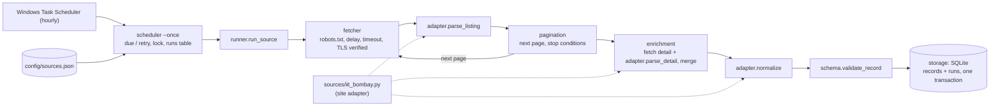

# web-monitor: academic event monitor (Week 2)

[Project README](../../README.md) · [Results](RESULTS.md) · [Audit fixes](assignments/week2_audit/FIXES.md)

## What Week 2 delivered

- **A scheduled monitor for IIT Bombay HSS "Seminars and Talks"**, live-tested against the real site: run 1 stored
  20 events, run 2 found `new=0 existing=20 changed=0` ([`live_demo.log`](assignments/08_schedule/live_demo.log)).
- **A generic pipeline** (`src/`) plus a small site **adapter** (`sources/iit_bombay.py`) and one **config entry**.
  Adding a site needs only an adapter + config; this was shown on two more sites (IIT Bombay ME, CMI) in the
  [audit](assignments/week2_audit/README.md).
- **Failure handling that is loud and non-destructive**: a failed fetch, a redesign or an unparseable date never
  erases stored data; each failure is logged with its stage and error type, and failed runs are retried with backoff.
- **Evidence for every claim**: 133 tests (no mocks; a local HTTP server replays saved real HTML), 92 % coverage from
  a fresh clone, an independent audit and one commit per fix. See [`RESULTS.md`](RESULTS.md).

## Architecture



Everything except the adapter is generic, and tests enforce the boundaries
([`tests/test_architecture.py`](tests/test_architecture.py)). Only `fetcher.py` makes HTTP requests, only
`storage.py` touches SQLite, and `src/` contains no site-specific strings.

## Assignment documents

| Assignment | Status | Entry point | Main documents |
|---|---|---|---|
| 1: structured logging | PASS | [README](assignments/01_logging/README.md) | [`failure_examples.md`](assignments/01_logging/failure_examples.md) (generated by `scripts/failure_examples_run.py`) |
| 3: recon / patterns | PASS | [README](assignments/03_patterns/README.md) | [`iit_bombay_structure.md`](assignments/03_patterns/iit_bombay_structure.md) |
| 4: pagination + URLs | PASS | [README](assignments/04_pagination/README.md) | [`iit_bombay_pagination_notes.md`](assignments/04_pagination/iit_bombay_pagination_notes.md), [`url_canonicalization_notes.md`](assignments/04_pagination/url_canonicalization_notes.md), [`live_run.json`](assignments/04_pagination/live_run.json) |
| 5: detail enrichment | PASS | [README](assignments/05_enrichment/README.md) | live run logs + merged records |
| 6: schema | PASS; team alignment DEFERRED | [README](assignments/06_schema/README.md) | [`schema_review.md`](assignments/06_schema/schema_review.md), [`records_inspected.json`](assignments/06_schema/records_inspected.json) |
| 7: shared template | PASS | [README](assignments/07_template/README.md) | [`iit_bombay_adapter_notes.md`](assignments/07_template/iit_bombay_adapter_notes.md) |
| 8: scheduling | PASS (incl. live demo) | [README](assignments/08_schedule/README.md) | [`schedule_notes.md`](assignments/08_schedule/schedule_notes.md), [`live_demo.log`](assignments/08_schedule/live_demo.log) |
| 9: template swap | NOT STARTED | — | Template swap with a teammate's framework; scheduled next. |
| Week 2 audit | fixes done; 3 KNOWN LIMITATIONS | [README](assignments/week2_audit/README.md) | [`AUDIT_REPORT.md`](assignments/week2_audit/AUDIT_REPORT.md), [`FIXES.md`](assignments/week2_audit/FIXES.md) |

There is no Assignment 2 folder in this project. Full benchmark with evidence per item: [`RESULTS.md`](RESULTS.md).

## How the pipeline works

Monitors institutional event listings, such as IIT Bombay HSS "Seminars and Talks", on a schedule. A **generic
pipeline** (`src/`) fetches politely, paginates, enriches from detail pages, validates against a shared schema and
stores changes in SQLite. Each site contributes only an **adapter** (`sources/<name>.py`, selectors and cleaning
rules) and a **config entry** (`config/sources.json`).

```text
fetch listing (robots.txt, delay, timeout, TLS verified) -> adapter.parse_listing -> [pagination]
  -> [detail pages: adapter.parse_detail, merged into the listing record] -> adapter.normalize
  -> assemble shared-schema record -> validate -> store (one transaction; new / existing / changed)
```

## Setup

Python 3.13 on Windows (the code is plain Python and also runs elsewhere).

```powershell
cd OSINT_SSRISS\Assignment_week_2\web-monitor          # inside your clone
python -m venv venv
venv\Scripts\python -m pip install -r requirements.txt
```

`requirements.txt` pins the direct dependencies (`requests`, `beautifulsoup4`, `certifi`, `pytest`, `pytest-cov`).

Keep the checkout path short on Windows. Some saved fixture names are long, and a clone under a deep folder
(roughly 100+ characters) exceeds the 260-character path limit; git then fails with `Filename too long`.
Alternatively, enable long paths (`git config --global core.longpaths true` plus the Windows `LongPathsEnabled`
policy).

## Running

| Command | What it does |
|---|---|
| `python -m src.scheduler --once` | Runs every **due** enabled source once, then exits. This is what Task Scheduler runs. Exit code 1 if any run failed. |
| `python -m src.scheduler --once --source <id> --force` | One source now, even if disabled or not yet due. |
| `python -m src.scheduler` | Loop mode: checks every 60 s (`--tick-s`). For demos. |
| `python scripts/fixture_site.py --port 8765` | Serves the saved HSS HTML on 127.0.0.1. The disabled `local_fixture` source points here, so `python -m src.scheduler --once --source local_fixture --db data/demo.db` runs the full pipeline with no network. |
| `python scripts/run_fixtures.py --show-records 2` | Runs the HSS config against the fixture site directly (no scheduler) into a temp DB. |

Other flags: `--db <path>` (default `data/events.db`), `--locks-dir <dir>`, `--config <path>`.

**When a source is due** (`src/scheduler.py`): it is due if it never ran; otherwise `interval_minutes` after its
last successful run, or `retry_minutes` after a failed one (default 60, doubling per consecutive failure: 60, 120,
240, …, capped at `interval_minutes`). Every cycle logs one `SCHEDULE` line per source with `last_status`,
`consecutive_failures`, `wait_minutes` and `next_due_reason` (`never_run`, `interval_after_success`,
`retry_after_failure`, `retry_after_unfinished_run`, `forced`). A per-source lock file (`locks/<source_id>.lock`)
prevents overlapping runs; a held lock is logged as `RUN_SKIPPED` and recorded as a `skipped` run.

**What counts as a failed run** (`runs.status = failed`, exit code 1, nothing stored): the listing's first page
cannot be fetched (HTTP error, network, TLS, robots.txt), the listing structure is gone (`StructuralError`), the
listing parses to 0 items (`EmptyListingError`, unless the source sets `allow_empty_listing: true`), or storage
fails (the whole run's writes roll back). Per-item problems do not fail the run: a detail page that fails
(`DETAIL_FAILURE`), a value the adapter cannot parse (`PARSE_WARNING`), and a record that fails validation
(`VALIDATION_FAILURE`, not stored). Neither a failed detail fetch nor an unparseable value ever erases stored data.

**Output**: table `records` (one row per canonical `item_url`, shared schema in `src/schema.py`) and table `runs`
(one row per run: status, counts, error), both in the `--db` file. The `data/events.db` in this working copy
predates the scheduler: it holds only the legacy Section 1-5 tables until the scheduler's first run against it.
Logs go to stdout as `YYYY-MM-DD HH:MM:SS [LEVEL] logger=<name> EVENT key=value …` (examples:
[`assignments/01_logging/failure_examples.md`](assignments/01_logging/failure_examples.md)).

## Adding a source (adapter + config only)

1. **Adapter** `sources/<name>.py` (no network, database or logging setup; `tests/test_architecture.py` enforces this):
   * `parse_listing(html, base_url) -> list[dict]`: one raw dict per item. `item_url` must come from
     `src.urls.resolve_item_url(href, base_url)`. If items have no URL of their own, use
     `src.urls.synthetic_item_url(base_url, <site id, or title + date>)` (rules in `src/schema.py`).
     Raise an error when the listing container is missing, so a redesign fails loudly.
   * `normalize(record) -> dict`: shared-schema content fields (`title`, `starts_at` as UTC
     `YYYY-MM-DDTHH:MM:SSZ` or date-only `YYYY-MM-DD`, `ends_at`, `timezone`, `speakers`, `venue`, `is_online`,
     `event_type`, `organizer`, `description`), `extras` for site-only fields, and optionally
     `parse_warnings: {field: raw}` for values present but unparseable (logged; stored values are kept).
   * `parse_detail(html, item_url) -> dict`: only if the source has detail pages (`supports_detail`).
   * Optional `NEXT_PAGE_SELECTOR` (default: `rel="next"` links).
2. **Config entry** in `config/sources.json` (unknown keys are rejected):

| Key | Meaning |
|---|---|
| `source_id`, `institution`, `adapter`, `listing_url` | required; `adapter` is a module path, e.g. `sources.iit_bombay` |
| `content_type`, `organizer` | copied into every record (`organizer` only when the adapter gives none) |
| `enabled` | picked up by `--once` without `--source` |
| `supports_pagination`, `max_pages` | follow next-page links, at most `max_pages` pages |
| `supports_detail`, `detail_limit` | fetch the detail page of the first `detail_limit` items |
| `request_delay_s`, `timeout_s` | politeness gap per host (robots.txt `Crawl-delay` wins if larger); per-request timeout |
| `interval_minutes`, `retry_minutes` | schedule after a success / first retry after a failure (default 60) |
| `lock_max_age_minutes` | a lock older than this is stale and removed |
| `allow_empty_listing` | default `false`: 0 parsed items fails the run |
| `ca_bundle` | PEM file for TLS verification, relative to the project root (see below) |

3. **Tests**: save real pages under `fixtures/<site>/`, test the adapter on them (see
   `tests/test_adapter_iit_bombay.py`), and serve them through `scripts/fixture_site.py` for an end-to-end run.
   `tests/test_generic_source.py` shows that a new source needs nothing else.

## Scheduled runs on Windows (Task Scheduler)

`scripts\run_scheduler_once.bat` changes into the project directory, runs `python -m src.scheduler --once` and
appends the output to `logs\scheduler.log`. Register it to fire **hourly**. The scheduler decides what is due
(HSS: daily after a success, 60 min after a failure), so an hourly trigger catches up within an hour after the PC
was off or asleep, and retries a failed run at the next trigger.

```bat
rem Run from the web-monitor folder in cmd.exe: %CD% expands to its full path when the task is created.
schtasks /Create /TN "WebMonitor\ScheduledRun" /SC HOURLY /MO 1 /F ^
  /TR "\"%CD%\scripts\run_scheduler_once.bat\""
schtasks /Run   /TN "WebMonitor\ScheduledRun"           & rem run now to test
schtasks /Query /TN "WebMonitor\ScheduledRun" /V /FO LIST
```

Then, in Task Scheduler → the task → Properties (settings `schtasks /Create` cannot set):

* **Settings → If the task is already running: "Do not start a new instance"**: a second guard next to the
  per-source lock file.
* **Settings → "Run task as soon as possible after a scheduled start is missed"**.
* **Settings → "Stop the task if it runs longer than" 1 hour**: far longer than a normal run (seconds), and no
  longer than `lock_max_age_minutes` (60).
* **Conditions → optionally "Wake the computer to run this task"**.
* If `python` isn't on the task account's PATH, set a user environment variable `WEB_MONITOR_PYTHON` to the full
  path of `venv\Scripts\python.exe`.

Change a schedule by editing `interval_minutes` / `retry_minutes` in `config/sources.json`. The config is re-read
every cycle, so no restart and no code change is needed.

## Tests

```powershell
venv\Scripts\python -m pytest                                  # main suite (tests/), no network
venv\Scripts\python -m pytest --cov=src --cov=sources          # with coverage
$env:LIVE_TESTS = "1"; venv\Scripts\python -m pytest tests\test_enrichment.py   # + the live HSS test
venv\Scripts\python -m pytest assignments\week2_audit\tests    # audit behaviour tests (see FIXES.md)
```

By default the suite never touches the network: every end-to-end test runs the real Fetcher, robots.txt handling,
pagination, enrichment, validation, SQLite and scheduler against a local HTTP(S) server (`scripts/fixture_site.py`)
that serves real saved HTML. Nothing is mocked. `LIVE_TESTS=1` enables the one live test, which requests a
mistyped HSS URL and expects a real 404; it is skipped otherwise.

## TLS certificates (`ca_bundle`)

Certificate verification is always on. The fetcher never retries with `verify=False`: a TLS failure is logged as
`FETCH_ERROR … error_type=SSLError` and fails the run.

`www.hss.iitb.ac.in` sends only its leaf certificate (`CN=iitb.ac.in`) and omits the intermediate
*GlobalSign RSA OV SSL CA 2018* (diagnosed 2026-09-26 with `openssl s_client -showcerts`: one certificate in the
chain, `verify error:num=21: unable to verify the first certificate`). Browsers and Windows schannel fetch the
missing intermediate from the leaf's AIA URL. OpenSSL, and therefore Python/requests, does not, so every request
fails with `CERTIFICATE_VERIFY_FAILED`.

The fix is the server's to make. Until then, the source's config entry sets
`"ca_bundle": "certs/iitb_ca_bundle.pem"`, which the fetcher passes to requests as `verify=<path>`. That file is
certifi's CA bundle plus `certs/globalsign_rsa_ov_ssl_ca_2018.pem` (fetched from the leaf's AIA URL; SHA-256 and
provenance in the file header; it chains to *GlobalSign Root CA - R3*, which certifi already trusts).
It adds only the one missing intermediate and trusts nothing beyond that.

* Rebuild after upgrading certifi: `python scripts/build_ca_bundle.py`.
* The intermediate expires 2028-11-21. Re-check the chain before then, or when HSS renews its certificate.
* Any source can use `ca_bundle` (a path relative to the project root; the config is rejected if the file is missing).

## Project structure

```text
web-monitor/
├── README.md  RESULTS.md       how it works / what it achieved (benchmark + evidence)
├── config/sources.json        source registry: one entry per source (HSS live + local_fixture demo)
├── src/                       GENERIC layer: no institution-specific code (enforced by tests/test_architecture.py)
│   ├── config.py              SourceConfig, JSON loader, adapter contract check
│   ├── fetcher.py             the only `requests` user: session, robots.txt, per-host delay, timeout, TLS, FETCH logs
│   ├── pagination.py          collect_listing: next-page walk + stop conditions
│   ├── enrich.py              detail-page fetch loop + listing/detail merge rule
│   ├── schema.py              shared record schema, assemble_record, validate_record (+ legacy Section 1-4A types)
│   ├── storage.py             the only `sqlite3` user: records (one transaction per run), content_hash, runs table
│   ├── runner.py              run_source(config): the pipeline
│   ├── scheduler.py           due/retry logic, per-source lock, run records, --once / loop CLI
│   ├── urls.py                resolve_item_url (the one canonicalizer) + synthetic_item_url
│   └── logging_config.py      the only log-handler setup + one helper per log event
├── sources/
│   ├── iit_bombay.py          HSS "Seminars and Talks" adapter (live source)
│   └── iit_bombay_legacy.py   Section 1-4A adapter for the hand-written fixtures (tests only, not in config)
├── scripts/                   fixture_site.py (local HTTP(S) server), run_fixtures.py, run_scheduler_once.bat,
│                              build_ca_bundle.py, failure_examples_run.py, check_links.py, open_db.bat/.ps1 (sqlite3 shell),
│                              live_pagination_run.py, detail_enrichment_run.py
├── certs/                     CA bundle for HSS (see TLS above)
├── fixtures/                  iit_bombay_hss/ (real saved HTML + manifest), iit_bombay/ (legacy hand-written), tls/ (test-only certs)
├── tests/                     main suite (see Tests)
├── assignments/               one folder per assignment: README, notes, logs (see the table at the top); week2_audit/
├── verification/              raw outputs of a fresh-clone run, quoted in RESULTS.md
├── data/  locks/  logs/       runtime state (git-ignored)
└── requirements.txt  pytest.ini
```
